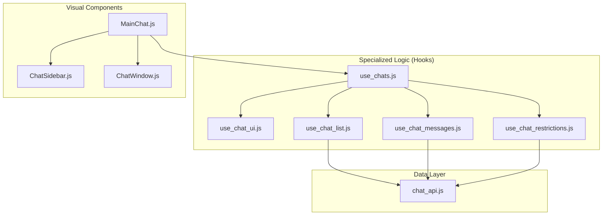

# Chat Module Architecture & Implementation Guide

This document provides a comprehensive overview of the chat system, its architecture, and the logic behind its implementation.

## 1. Architecture Overview

---

## 2. Component Roles

### MainChat.js
The entry point. It captures state from the router (e.g., if navigating from an order page) and renders the sidebar and window.

### ChatSidebar.js
Displays the list of active conversations.
- **Features**: Pagination with ellipses, sorting by latest activity.

### ChatWindow.js
The active chat interface.
- **Features**: Message history, Load More, auto-scroll.

---

## 3. Specialized Hooks (The "Brain")

### use_chats.js
Central orchestrator composing all sub-hooks.

### use_chat_ui.js
Manages mobile responsiveness and view toggles.

### use_chat_list.js
Handles sidebar fetching, pagination, and multi-call protection.

### use_chat_messages.js
Manages message synchronization and sending logic.

### use_chat_restrictions.js
Enforces order-status based chat expiry rules.

---

## 4. API Layer (chat_api.js)

Service layer using `fetch` with `AbortSignal` support.

---

## 5. Key Logic Features

- **Double-Fetch Protection**: Uses `useRef` + `AbortController`.
- **Lazy Initialization**: Database entry created only on the first message.
- **Responsive Design**: Auto-hides sidebar on mobile when a chat is open.
